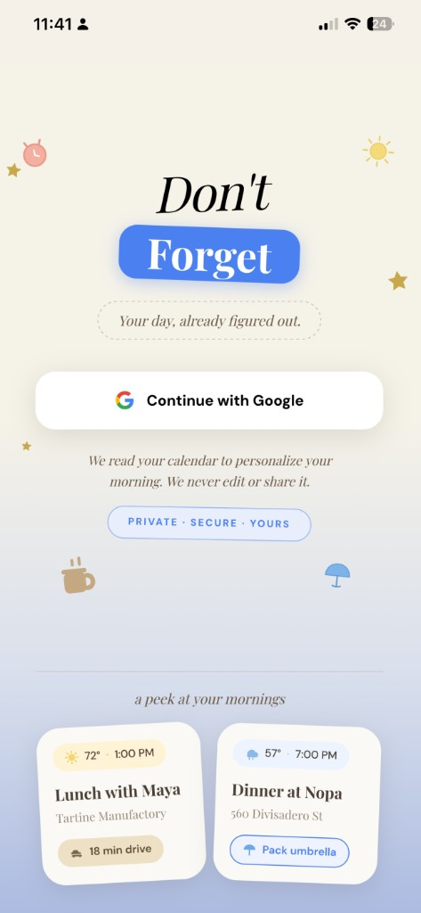
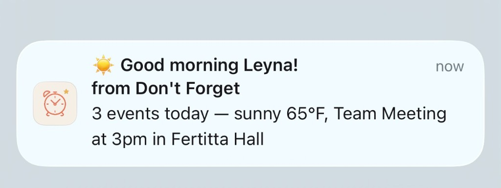
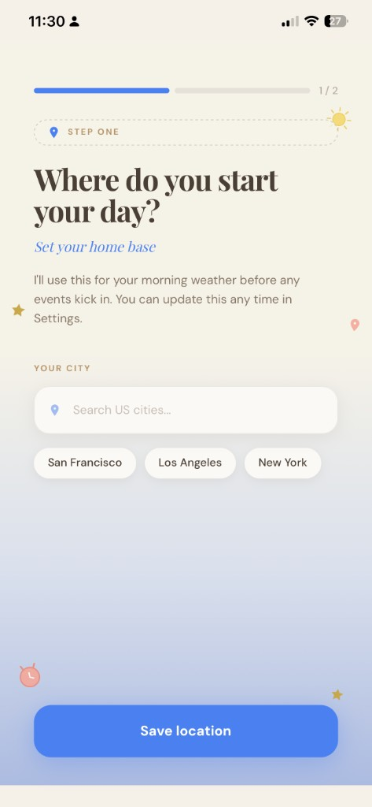
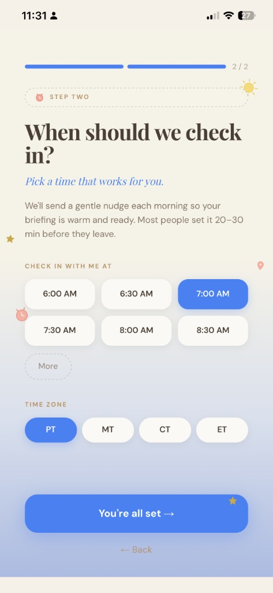
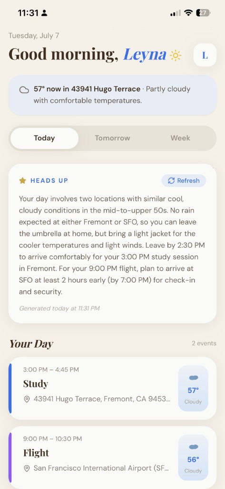
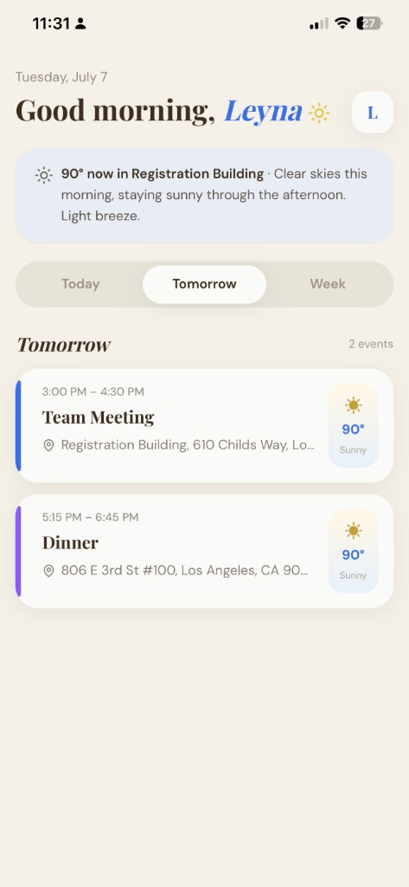
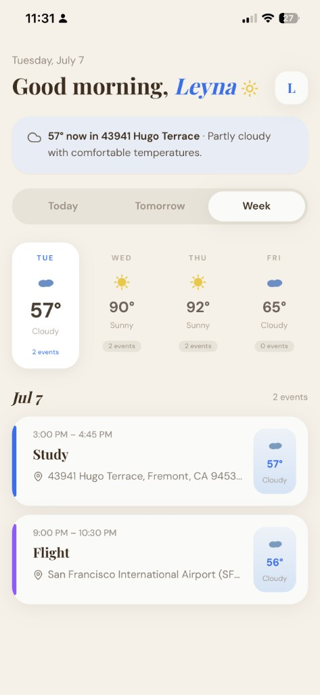
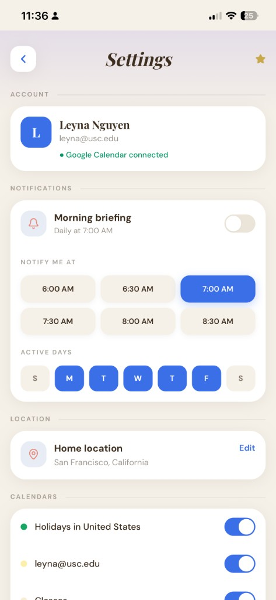
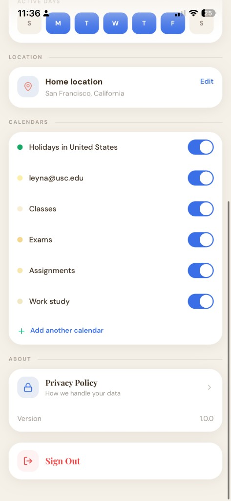

# Don't Forget

**Your AI-powered morning briefing**

## ✨ Live Demo

**[→ Try Don't Forget](https://dont-forget-kappa.vercel.app)**

Don't Forget is currently pending Google OAuth verification to open access to everyone. To request access, email [leynan246@gmail.com](mailto:leynan246@gmail.com) with your Gmail address to be added as a test user.

---

## What It Does

Don't Forget consolidates your Google Calendar, weather forecasts, and Claude AI into a single personalized morning brief. Each day, the app reviews your schedule, checks the weather at every event location, and delivers practical advice — what to wear, what to bring, and when to leave — via push notification at your chosen time (default 7:00 AM).

---

## Features

- **Google OAuth sign in** — Connect your Google account securely
- **Personalized AI morning brief** — Powered by Claude
- **Per-location weather** — Weather for each calendar event with a location
- **Push notifications** — Daily briefs delivered via the Web Push API
- **PWA** — Installable on iPhone and Android from the browser
- **Week view** — Seven-day outlook with weather forecasts
- **Onboarding flow** — Guided setup for home city and notification time

---

## Tech Stack

| Layer | Technology |
| --- | --- |
| Framework | Next.js 14, TypeScript, Tailwind CSS |
| AI | Claude API (Anthropic) |
| Calendar | Google Calendar API |
| Geocoding | Google Maps Geocoding API, OpenWeatherMap Geocoding |
| Weather | OpenWeatherMap API |
| Auth | NextAuth.js (Google OAuth) |
| Storage | Upstash Redis |
| Hosting | Vercel |

---

## How It Works

When your morning notification fires, Don't Forget runs a pipeline to build your brief:

```
Google Calendar  →  Geocoding  →  Weather  →  Claude AI  →  Push Notification
```

1. **Calendar** — Fetches today's events from your connected Google Calendars
2. **Geocoding** — Resolves each event location to coordinates
3. **Weather** — Pulls forecast data for every location (and your home city)
4. **Claude** — Generates a concise, actionable morning brief from the combined data
5. **Push notification** — Delivers the brief to your device via the Web Push API

A Vercel cron job triggers this pipeline daily for all subscribed users.

---

## Getting Started

### Prerequisites

- Node.js 18+
- Google Cloud project with OAuth credentials and Calendar API enabled
- Anthropic API key
- OpenWeatherMap API key
- Upstash Redis database
- VAPID keys for Web Push

### Installation

```bash
git clone https://github.com/LeynaNguyen2/dont-forget.git
cd dont-forget
npm install
```

### Environment Variables

Copy the example env file and fill in your values:

```bash
cp .env.example .env.local
```

| Variable | Description |
| --- | --- |
| `GOOGLE_CLIENT_ID` | Google OAuth client ID |
| `GOOGLE_CLIENT_SECRET` | Google OAuth client secret |
| `NEXTAUTH_SECRET` | Random secret for NextAuth session encryption |
| `NEXTAUTH_URL` | App URL (e.g. `http://localhost:3000` or your Vercel URL) |
| `ANTHROPIC_API_KEY` | Anthropic API key for Claude |
| `OPENWEATHER_KEY` | OpenWeatherMap API key (weather + geocoding) |
| `GOOGLE_API_KEY` | Google Maps Geocoding API key (fallback geocoding) |
| `UPSTASH_REDIS_REST_URL` | Upstash Redis REST URL |
| `UPSTASH_REDIS_REST_TOKEN` | Upstash Redis REST token |
| `NEXT_PUBLIC_VAPID_PUBLIC_KEY` | Web Push VAPID public key |
| `VAPID_PRIVATE_KEY` | Web Push VAPID private key |
| `VAPID_SUBJECT` | Contact email for push service (e.g. `mailto:you@example.com`) |
| `CRON_SECRET` | Secret for authenticating the daily `/api/notify` cron job |

Generate VAPID keys with:

```bash
npx web-push generate-vapid-keys
```

### Run Locally

```bash
npm run dev
```

Open [http://localhost:3000](http://localhost:3000) and sign in with Google.

---

## Screenshots

<div align="center">

<br /><br />

<p>Morning push notification</p>
<br /><br />







</div>

---

## License

Private project. All rights reserved.
